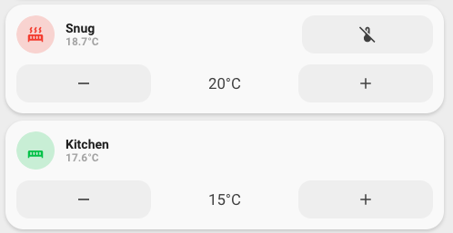

<!-- markdownlint-disable MD046 -->

# Custom-card "Honeywell EvoHome Thermostat (EU)"

The `custom_card_nwootton_evohome_thermostat` allows you to display a single entry per Zone as configured. There are 2 templates: `custom_card_garbage_collection_with_buttons` and `custom_card_garbage_collection_with_buttons_and_control`.



`custom_card_garbage_collection_with_buttons` allows for display of current zone name, with the measured current temperature displayed underneath. The second row displays the current zone set-point with the expected increase and decrease set-point (+ & -) buttons on either side. A single tap on either button will alter the set-point by 0.5 degrees.

`custom_card_garbage_collection_with_buttons_and_control` is a second template that adds a button to the top row that can be used to toggle an input_boolean entity. This is labelled as a 'boost' capability and was designed to allow for boosting the heating in a specific zone for a fixed duration.

Icon will change to red if preset is either *temporary* or *permanent*. Green if preset is *none*, grey if preset is *off*.

## Credits

Author: nwootton - 2022
Version: 0.0.1

Code is based on the `custom_card_httpedo13_thermostat` that comes with the UI-Minimalist platform theme.

## Changelog

<details>
<summary>0.0.1</summary>
Initial release
</details>


## Usage

```yaml
- type: custom:button-card
  template: custom_card_nwootton_evohome_thermostat_with_buttons
  variables:
    entity: climate.lounge
    name: Lounge

```

```yaml
- type: custom:button-card
  template: custom_card_nwootton_evohome_thermostat_with_buttons_and_control
  variables:
    entity: climate.lounge
    name: Lounge
    boost: input_boolean.boost_lounge
```

## Requirements

Uses the Honeywell Total Connect Comfort (Europe) (a.k.a. EvoHome) integration for EU in Home Assistant. Assumes that all zones are already configured and that the appropriate evohome specific services are available within your installation.

## Variables

<table>
<tr>
<th>Variable</th>
<th>Example</th>
<th>Required</th>
<th>Explanation</th>
</tr>
<tr>
<td>entity</td>
<td>climate.zone</td>
<td>yes</td>
<td>Zone entity</td>
</tr>
<tr>
<td>name</td>
<td>string</td>
<td>no</td>
<td>Friendly name of Zone</td>
</tr>
<tr>
<td>boost</td>
<td>string</td>
<td>no</td>
<td>Name of additional input_boolean that can be triggered from the dashboard instance</td>
</tr>
</table>

## Template code

```yaml
---
custom_card_nwootton_evohome_thermostat:
  template:
    - ulm_language_variables
    - custom_card_nwootton_evohome_thermostat_language_variables
  tap_action:
    action: more-info
  icon: |
    [[[
        if (entity.attributes.preset_mode =='none') {
          return 'mdi:radiator-disabled';
        } else if (entity.attributes.preset_mode =='temporary') {
          return 'mdi:radiator';
        } else if (entity.attributes.preset_mode =='permanent') {
          return 'mdi:radiator';
        } else {
          return 'mdi:radiator-off';
        }
    ]]]
  label: >-
    [[[
      return entity.attributes.current_temperature + '°C';
    ]]]
  state:
    - operator: template
      value: >
        [[[
          return entity.attributes.preset_mode == 'none';
        ]]]
      styles:
        icon:
          - color: 'rgba(var(--color-green),1)'
        img_cell:
          - background-color: 'rgba(var(--color-green),0.2)'

    - operator: template
      value: >
        [[[
          return entity.attributes.preset_mode == 'temporary';
        ]]]
      styles:
        icon:
          - color: 'rgba(var(--color-red),1)'
        img_cell:
          - background-color: 'rgba(var(--color-red),0.2)'

    - operator: template
      value: >
        [[[
          return entity.attributes.preset_mode == 'permanent';
        ]]]
      styles:
        icon:
          - color: 'rgba(var(--color-red),1)'
        img_cell:
          - background-color: 'rgba(var(--color-red),0.2)'


custom_card_nwootton_evohome_thermostat_with_buttons:
  triggers_update: "all"
  variables:
    name: null
  styles:
    grid:
      - grid-template-areas: '"item1" "item2"'
      - grid-template-columns: 1fr
      - grid-template-rows: min-content  min-content
      - row-gap: 12px
    card:
      - border-radius: var(--border-radius)
      - box-shadow: var(--box-shadow)
      - padding: 12px
  custom_fields:
    # Row 1 - top row
    item1:
      card:
        type: custom:button-card
        template: list_items_favorite
        custom_fields:
          # Column 1 - Icon & Name
          item1:
            card:
              type: 'custom:button-card'
              template:
                - icon_info
                - custom_card_nwootton_evohome_thermostat
              tap_action:
                action: call-service
                service: input_boolean.toggle
                service_data:
                  entity_id: '[[[ return variables.boost ]]]'
              hold_action:
                action: more-info
              name: >
                [[[
                    if (variables.name == null) {
                      return variables.entity;
                    }
                    return variables.name;
                ]]]
              entity: '[[[ return variables.entity ]]]'
          # Column 2 - Empty
          item2:
            card:
              type: horizontal-stack
              cards:
                - type: "custom:button-card"
                  color_type: blank-card

    # Row 2 - Bottom row
    item2:
      card:
        type: 'custom:button-card'
        template: list_items
        custom_fields:
          # Left button '-'
          item1:
            card:
              type: 'custom:button-card'
              template: widget_icon
              tap_action:
                action: call-service
                service: climate.set_temperature
                service_data:
                  entity_id: '[[[ return variables.entity ]]]'
                  temperature: '[[[ return (parseFloat(states[variables.entity].attributes.temperature) - 0.5) ]]]'
              icon: 'mdi:minus'

          # Centre temperature
          item2:
            card:
              type: 'custom:button-card'
              template: widget_temperature
              tap_action:
                action: none
              entity: '[[[ return variables.entity ]]]'
              icon: 'mdi:temperature-celsius'

          # Right button '+'
          item3:
            card:
              type: 'custom:button-card'
              template: widget_icon
              tap_action:
                action: call-service
                service: climate.set_temperature
                service_data:
                  entity_id: '[[[ return variables.entity ]]]'
                  temperature: '[[[ return (parseFloat(states[variables.entity].attributes.temperature) + 0.5) ]]]'
              icon: 'mdi:plus'

custom_card_nwootton_evohome_thermostat_with_buttons_and_control:
  triggers_update: "all"
  variables:
    name: null
    boost: null
  styles:
    grid:
      - grid-template-areas: '"item1" "item2"'
      - grid-template-columns: 1fr
      - grid-template-rows: min-content  min-content
      - row-gap: 12px
    card:
      - border-radius: var(--border-radius)
      - box-shadow: var(--box-shadow)
      - padding: 12px
  custom_fields:
    # Row 1 - top row
    item1:
      card:
        type: custom:button-card
        template: list_items_favorite
        custom_fields:
          # Column 1 - Icon & Name
          item1:
            card:
              type: 'custom:button-card'
              template:
                - icon_info
                - custom_card_nwootton_evohome_thermostat
              tap_action:
                action: call-service
                service: input_boolean.toggle
                service_data:
                  entity_id: '[[[ return variables.boost ]]]'
              hold_action:
                action: more-info
              name: >
                [[[
                    if (variables.name == null) {
                      return variables.entity;
                    }
                    return variables.name;
                ]]]
              entity: '[[[ return variables.entity ]]]'
          # Column 2 - Button
          item2:
            card:
              type: horizontal-stack
              cards:
                - type: conditional
                  conditions:
                    - entity: '[[[ return variables.boost ]]]'
                      state: 'off'
                  card:
                    type: custom:button-card
                    template: widget_icon
                    tap_action:
                      action: call-service
                      service: input_boolean.turn_on
                      service_data:
                        entity_id: '[[[ return variables.boost ]]]'
                    icon: mdi:thermometer-plus
                - type: conditional
                  conditions:
                    - entity: '[[[ return variables.boost ]]]'
                      state_not: 'off'
                  card:
                    type: custom:button-card
                    template: widget_icon
                    tap_action:
                      action: call-service
                      service: input_boolean.turn_off
                      service_data:
                        entity_id: '[[[ return variables.boost ]]]'
                    icon: mdi:thermometer-off

    # Row 2 - Bottom row
    item2:
      card:
        type: 'custom:button-card'
        template: list_items
        custom_fields:
          # Left button '-'
          item1:
            card:
              type: 'custom:button-card'
              template: widget_icon
              tap_action:
                action: call-service
                service: climate.set_temperature
                service_data:
                  entity_id: '[[[ return variables.entity ]]]'
                  temperature: '[[[ return (parseFloat(states[variables.entity].attributes.temperature) - 0.5) ]]]'
              icon: 'mdi:minus'

          # Centre temperature
          item2:
            card:
              type: 'custom:button-card'
              template: widget_temperature
              tap_action:
                action: none
              entity: '[[[ return variables.entity ]]]'
              icon: 'mdi:temperature-celsius'

          # Right button '+'
          item3:
            card:
              type: 'custom:button-card'
              template: widget_icon
              tap_action:
                action: call-service
                service: climate.set_temperature
                service_data:
                  entity_id: '[[[ return variables.entity ]]]'
                  temperature: '[[[ return (parseFloat(states[variables.entity].attributes.temperature) + 0.5) ]]]'
              icon: 'mdi:plus'


# This is the items in the bottom row ?
list_items_favorite:
  styles:
    grid:
      - grid-template-areas: '"item1 item1 item2"'
      - grid-template-columns: 1fr 1fr 1fr
      - grid-template-rows: min-content
      - column-gap: 7px
    card:
      - box-shadow: none
      - padding: 0px

# This is the temperature in the middle of the bottom row.
# It is the SETPOINT temperature
widget_temperature:
  tap_action:
    action: toggle
  color: var(--color-grey)
  show_icon: false
  show_name: false
  show_label: true
  size: 20px
  label: |-
    [[[
        var temperature = entity.attributes.temperature;
        if (temperature == null) {
          var temperature = '-';
        }
        return temperature + '°C'
    ]]]
  styles:
    label:
      - color: 'rgb(var(--color-theme),0.9)'
    grid:
      - grid-template-areas: '"l"'
    card:
      - box-shadow: none
      - padding: 0px
      - background-color: 'rgba(var(--color-theme),0)'
      - border-radius: 14px
      - place-self: center
      - height: 42px
```
