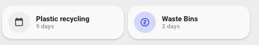
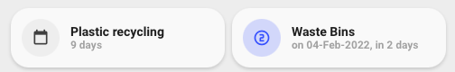

---
---
title: custom_card_nwootton_garbage_collection
hide:
  - toc
---
<!-- markdownlint-disable MD046 -->

# Custom-card "Garbage Collection"

The `custom_card_nwootton_garbage_collection` allows you to display a single entry per configured collection. Includes either the full verbose output or the simpleified `today`, `tomorrow` or in `X days` depending on configuration.



Simple mode shows the number of days until collection day.



Verbose mode shows the date and days until collection.

Icon changes colour and style based on time to collection - red 0 for today, green 1 for tomorrow and blue calendar for further in the future.

## Credits

Author: nwootton - 2022
Version: 0.0.1

Code is based on the `card_generic` that comes with UI-Minimalist platform theme.
## Changelog

<details>
<summary>0.0.1</summary>
Initial release
</details>


## Usage

```yaml
  - type: 'custom:button-card'
    template: custom_card_nwootton_garbage_collection
    entity: sensor.plastic_recycling
```

```yaml
  - type: 'custom:button-card'
    template: custom_card_nwootton_garbage_collection
    entity: sensor.waste_bins
    variables:
      ulm_card_uses_verbose: true
```

## Requirements

Uses the Garbage Collection Card by bruxy70. Git repo https://github.com/bruxy70/Garbage-Collection

## Variables

<table>
<tr>
<th>Variable</th>
<th>Example</th>
<th>Required</th>
<th>Explanation</th>
</tr>
<tr>
<td>entity_</td>
<td>sensor.waste_bins</td>
<td>yes</td>
<td>Your garbage entity</td>
</tr>
<tr>
<td>ulm_card_uses_verbose</td>
<td>true/false</td>
<td>no</td>
<td>Garbage card can display a verbose respons ethat indicated date of collection and how many days</td>
</tr>
</table>

## Template code

```yaml
---
### Garbage Collection Card for use with https://github.com/bruxy70/Garbage-Collection ###
custom_card_nwootton_garbage_collection:
  template:
    - "icon_info_bg"
    - "ulm_language_variables"
    - "custom_card_nwootton_garbage_collection_language_variables"
  label: >
    [[[ return entity.attributes.friendly_name]]]
  name: >
    [[[
      var myName = "";

      if (variables.ulm_card_uses_verbose) {
        myName = entity.state;
      }
      else {
        if ( parseInt(entity.attributes.days) == 1) {
          myName = variables.custom_card_nwootton_garbage_collection_today;
        } else if ( parseInt(entity.attributes.days) == 2) {
          myName = variables.custom_card_nwootton_garbage_collection_tomorrow;
        } else {
          myName = entity.attributes.days + " " + variables.custom_card_nwootton_garbage_collection_days;
        }
      }
      return myName;
    ]]]
  icon: >
    [[[
      var myIcon = "";
      if (parseInt(entity.attributes.days) == 1) {
        myIcon = "mdi:numeric-0-circle-outline";
      } else if (parseInt(entity.attributes.days) == 2) {
        myIcon = "mdi:numeric-1-circle-outline";
      } else {
        myIcon = "mdi:calendar-blank";
      }
      return myIcon;
    ]]]
  styles:
    icon:
      - color: "rgba(var(--color-theme),0.9)"
    label:
      - align-self: "end"
      - justify-self: "start"
      - font-weight: "bold"
      - font-size: "14px"
      - margin-left: "12px"
      - filter: "opacity(100%)"
    name:
      - justify-self: "start"
      - align-self: "start"
      - font-weight: "bolder"
      - font-size: "12px"
      - filter: "opacity(40%)"
      - margin-left: "12px"
    grid:
      - grid-template-areas: "'i l' 'i n'"
      - grid-template-columns: "min-content auto"
      - grid-template-rows: "min-content min-content"
  state:
    - operator: "template"
      value: "[[[return parseInt(entity.attributes.days) == 1 ]]]"
      styles:
        icon:
          - color: "rgba(var(--color-red),1)"
        img_cell:
          - background-color: "rgba(var(--color-red),0.2)"
    - operator: "template"
      value: "[[[return parseInt(entity.attributes.days) == 2 ]]]"
      styles:
        icon:
          - color: "rgba(var(--color-green),1)"
        img_cell:
          - background-color: "rgba(var(--color-green),0.2)"
    - operator: "template"
      value: "[[[return parseInt(entity.attributes.days) > 2 ]]]"
      styles:
        icon:
          - color: "rgba(var(--color-blue),1)"
        img_cell:
          - background-color: "rgba(var(--color-blue),0.2)"


```
